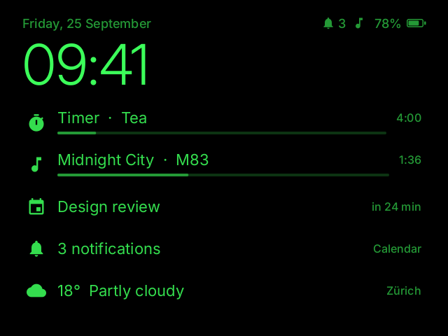

# Faceclaw Edit

Eigenständiger Neubau einer Begleit-App für die **Even Realities G2**-Brille, mit eigenem Design und
eigener Architektur. Inspiriert von [Faceclaw](https://github.com/jimrandomh/faceclaw), aber von
Grund auf neu geschrieben: reines Kotlin, eine plattformunabhängige Kernbibliothek, eine Android-App
und ein Desktop-Simulator, mit dem sich die Brillen-Oberfläche ohne Hardware entwickeln lässt.



> **Status: 0.1 (Vorabversion).** Grafik-Engine, UI-Baukasten, Shell, zehn Apps, das komplette
> Bluetooth-Protokoll inkl. Custom-Firmware-Transport und die Android-App sind umgesetzt und mit
> Tests gegen die dokumentierten Protokoll-Vektoren und eine simulierte Brille abgesichert.
> **Auf echter Hardware ist diese Version noch nicht getestet.** Siehe [Roadmap](docs/roadmap.md).

## Was kann die App?

Auf der Brille (640 × 480, grün, bedient mit dem R1-Ring oder den Touchpads):

| | |
|---|---|
| **Startbildschirm** | große Uhr, Datum, Akku, darunter live „Glance-Karten“: laufender Timer, Musik, nächster Termin, Benachrichtigungen, Wetter |
| **Launcher** | App-Liste mit gleitender Auswahl; laufende Apps sind markiert |
| **Benachrichtigungen** | Liste, Detailansicht, Aktionen, Schnellantworten (mit echtem Antworttext), Popups |
| **Musik** | Titel, Cover, Fortschritt, Wiedergabe-Steuerung, Lautstärke |
| **Timer & Stoppuhr** | laufen im Hintergrund weiter, Alarm-Overlay mit Signalton |
| **Agenda, Wetter, Kompass, Teleprompter, Einstellungen** | siehe [Screenshots](docs/screenshots) |

Bedienung überall gleich: **Wischen** = vor/zurück, **Tippen** = auswählen, **Doppeltippen** = zurück,
**Halten** = Menü (Home, App wechseln, Helligkeit, App schließen, Display aus).

Auf dem Handy: Live-Vorschau der Brillenanzeige, die gleichzeitig als Touchpad dient (funktioniert
auch ganz ohne Brille), Kopplung, Einstellungen, Teleprompter-Editor (Text aus jeder App teilen).

## Voraussetzungen

- Android 10 oder neuer.
- G2-Brille mit der **Faceclaw-Custom-Firmware, Revision 34 oder neuer** (`Faceclaw/34`). Sie wird
  mit der Original-App [Faceclaw](https://github.com/jimrandomh/faceclaw) (Onboarding) oder mit
  [g2flash](https://github.com/jimrandomh/g2flash) installiert. Diese App erkennt die Firmware und
  verbindet sich nicht mit Stock- oder zu alter Firmware (sie sendet dann auch keine
  Custom-Befehle). Ein eigener Installer ist bewusst noch nicht enthalten: ein ungetesteter
  Flasher kann die Brille unbrauchbar machen.
- Die offizielle Even-App darf nicht gleichzeitig mit der Brille verbunden sein.

## Bauen und starten

```bash
./gradlew :core:test             # Kern-Tests (JVM, keine Hardware nötig)
./gradlew :app:assembleDebug     # APK: app/build/outputs/apk/debug/app-debug.apk
./gradlew :simulator:run         # Brillen-Simulator auf dem Desktop
./gradlew :simulator:screenshots # alle Bildschirme als PNG nach docs/screenshots
```

Für die Android-App wird das Android SDK benötigt (`ANDROID_HOME` oder `local.properties`),
alternativ einfach das Projekt in Android Studio öffnen. Jeder Push baut außerdem per GitHub Actions
ein Debug-APK (Artefakt „faceclaw-edit-debug-apk“).

**Simulator-Tasten:** ↑/↓ wischen · Enter tippen · Backspace/Esc doppeltippen · L halten ·
Q tippen-und-halten · N neue Benachrichtigung · D Display an/aus · W Brille ab-/aufsetzen.

**Erste Schritte mit Brille:** App öffnen → Einrichtung (Bluetooth, Benachrichtigungszugriff,
Hintergrundbetrieb) erlauben → „Pair glasses“ → Brille aus dem Etui nehmen, beide Bügel erscheinen als
ein Paar → antippen → die beiden Android-Kopplungsanfragen bestätigen.

## Eigene Apps und eigenes Design

Das ganze Aussehen steht an einer Stelle: [`Theme.kt`](core/src/main/kotlin/com/madtreasures/faceclaw/core/ui/Theme.kt)
(Helligkeitsstufen, Schriften, Abstände, Radien, Animationen). Eine eigene App ist wenige Zeilen:

```kotlin
class HelloApp : GlassApp() {
    override fun createRootScreen() = object : Screen() {
        override val title = "Hallo"
        override fun render(g: Canvas, bounds: IntRect) {
            g.drawTextIn("Hallo Welt", bounds, theme.type.headline, theme.levels.textStrong, HAlign.Center)
        }
        override fun onAction(action: Action) = false
    }
}
// registrieren in core/.../runtime/GlassesRuntime.kt → AppCatalog.build():
r.register(AppInfo("hello", "Hallo", Icons.Star) { HelloApp() })
```

Listen, Umschalter, Schieberegler, Auswahlen, Textseiten, Menüs, Dialoge und Popups gibt es fertig
(`MenuList`, `TextPager`, `ui.showMenu`, `ui.confirm`, `ui.toast`). Neue Schriften oder Größen:
TTF nach `tools/fonts/`, in `FontBaker.kt` eintragen, `./gradlew :tools:bakeFonts`.
Details: [docs/architektur.md](docs/architektur.md).

## Projektstruktur

| Modul | Inhalt |
|---|---|
| `core/` | reines Kotlin ohne Android: Grafik-Engine, Schriften, UI-Baukasten, Shell, Apps, G2-Protokoll, simulierte Brille |
| `app/` | Android-App: Bluetooth (GATT), Vordergrunddienst, Benachrichtigungen, Medien, Kalender, Wetter, Compose-UI |
| `simulator/` | Desktop-Simulator und Screenshot-Werkzeug |
| `tools/` | Font-Baker (TTF → Bitmap-Schrift, Icon-Katalog) |
| `docs/analysis/` | technische Analyse der Originale (Protokolle, Formate, Abläufe) |

## Lizenz und Dank

GPLv3 (siehe [LICENSE](LICENSE)), wie Faceclaw und g2flash, auf deren veröffentlichtem Protokollwissen
dieser Neubau aufbaut. Siehe [ACKNOWLEDGEMENTS.md](ACKNOWLEDGEMENTS.md). Keine Verbindung zu Even
Realities; Nutzung auf eigene Verantwortung.
